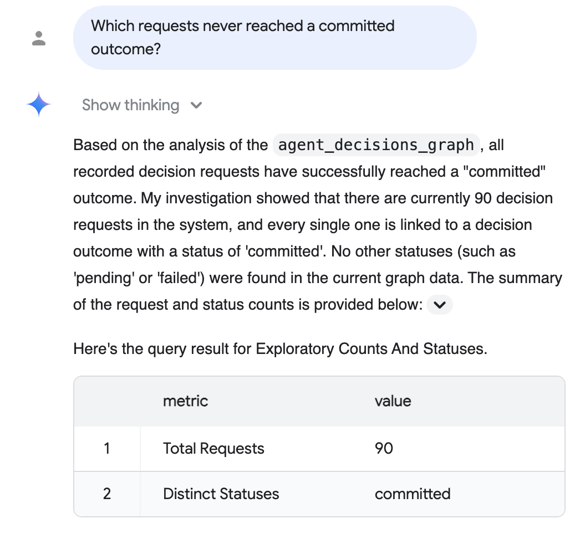

# Trace AI Agent Decisions with BigQuery Property Graphs

**Byline**:


*BigQuery property graphs, BigQuery Conversational Analytics, and the BigQuery Agent Analytics SDK are currently in Preview on Google Cloud. The BigQuery Agent Analytics Plugin is Generally Available (GA). Examples in this post use synthetic data.*

Enterprises are rapidly deploying AI agents to transform their data platforms into proactive [Systems of Action](https://cloud.google.com/transform/shift-system-of-action-architecting-the-agentic-data-cloud-ai). However, scaling these mission-critical applications requires a reliable foundation of trust. Historically, systems of record focused on capturing what happened; in the agentic era, organizations must capture why it happened. When an auditor or executive asks "Why did the agent make that decision?", organizations need prompt, verifiable visibility into the agent's dynamic reasoning: its context, weighed options, exceptions granted, and final actions. Today, we are introducing Context Graph in BigQuery: an integrated solution that elevates standard agent telemetry into a structured, audit-ready graph of decisions. By capturing every action and linking it to its triggering context, Context Graph provides the transparent, reliable foundation you need to scale your System of Action with confidence.

## The challenge of a trusted system of action

AI agents provide a natural mechanism for reasoning over live data, orchestrating complex cross-system tasks, and driving proactive business outcomes. However, deploying autonomous agents for mission-critical applications at enterprise scale often presents the following challenges:

* **Lack of transparency and trust:** As agents take actions on your behalf, it can be difficult to determine exactly why an agent made a specific decision, what data it touched, or whether you can confidently trust the outcome. Traditional data tools often just store the final outcome, suffering from an "amnesia" that loses the inputs, context, and synthesis that led to that specific action.

* **Increased business risk:** Without clear, explainable visibility into automated actions, organizations are left vulnerable to potential monetary losses and internal policy violations. When an agent makes an anomalous choice, such as executing a transaction at an unexpected price, the inability to trace its root cause makes the system incredibly difficult to debug and reliably govern. Effective governance requires an auditable process to verify that guardrails are actually working.

* **Unmanageable telemetry:** While tools like Google's Agent Development Kit (ADK) make it substantially easier to build and deploy agents, the raw traces they produce, such as event logs, tool calls, and reasoning steps, are inherently unstructured. This leaves the data difficult to query, hard to audit, and challenging to govern at scale. The valuable precedents buried in these logs are often lost, preventing the system from building a feedback loop to learn from past decisions.

## Introducing Context Graph in BigQuery

Context Graph in BigQuery transforms raw agent traces into a structured, trusted context, elevating flat telemetry into an interconnected, traversable web of decision traces, data lineage, and tool executions. Built on [BigQuery Agent Analytics](https://cloud.google.com/blog/products/data-analytics/introducing-bigquery-agent-analytics), which centralizes your Agent Development Kit (ADK) events directly in BigQuery, it connects every reasoning step to make automated decisions highly auditable. By doing so, it serves as a queryable "institutional memory" for your data platform, capturing the exceptions, overrides, and precedents that map how decisions are actually made.

Crucially, this happens natively within your existing data warehouse; there is no need to export logs to a specialized graph database or build complex ETL pipelines. By providing this structured, easily queryable visibility, Context Graph helps organizations not just deploy a system of agents, but build a proactive system of action they can stand behind.


## Context Graph in agentic media buying

Consider digital media buying, where sell-side processes, like negotiating ad placements, evaluating pricing rules, and checking compliance, historically took weeks of manual handoffs and spreadsheet coordination. By deploying an autonomous Seller Agent, a digital media company can compress this entire lifecycle from months down to seconds. However, moving real advertising budgets at machine speed requires regulator-grade trust. If an executive or auditor asks why a specific live campaign was executed at a certain price point, digging through fragmented, raw system logs with ad-hoc SQL is the wrong control surface.

By using BigQuery Context Graph, the company can verify that every automated decision is transparent and auditable. Every time the Seller Agent takes an action, the process is captured and structured automatically:

* **Capturing the action:** The moment the agent queries a knowledge graph, hands a task to a specialized brand-safety sub-agent, or evaluates an inventory pricing rule, the event is captured natively by the BigQuery Agent Analytics plugin.

* **Structuring the trace:** Instead of dumping these details into messy text logs, the system shapes the raw telemetry into a typed, queryable Context Graph based on the company's provided ontology.

* **Answering the audit:** If a campaign's parameters need to be verified, compliance teams can traverse the resulting graph to see exactly which active contracts, floor prices, and brand safety rules triggered that specific execution.

By turning flat log files into an interconnected relationship map, the company doesn't just run a fast system, it has a strictly governed, trusted system of action.

## Let's walk through an example

The example below uses the same generic agent decision flow the [hands-on codelab](https://github.com/GoogleCloudPlatform/BigQuery-Agent-Analytics-SDK/blob/main/docs/codelabs/periodic_materialization.md) runs end to end: a request comes in, the agent weighs options with confidence scores, and an outcome is committed. Everything runs natively in BigQuery.

### Step 1: Capture agent traces

In production, the Generally Available BigQuery Agent Analytics Plugin captures agent activity (tool calls, LLM requests, approvals) the moment your ADK agent runs and stream-writes it to a structured `agent_events` table:

```py
from google.adk.plugins import BigQueryAgentAnalyticsPlugin

plugin = BigQueryAgentAnalyticsPlugin(
    project_id="your-project-id",
    dataset_id="agent_analytics",
)
runner = Runner(agent=root_agent, plugins=[plugin])
```

To follow along without an agent, the SDK ships a generator that writes a realistic, production-shaped corpus directly to `agent_events`:

```bash
bqaa seed-events \
    --project-id "$PROJECT_ID" --dataset-id "$DATASET" \
    --scenario decision-realistic --seed 42
```

### Step 2: Define the context graph

Declare the graph shape once, in standard SQL. This models the decision flow: requests, the options each request weighed, the committed outcome, and the edges that connect them.

```sql
CREATE OR REPLACE PROPERTY GRAPH agent_analytics.agent_decisions_graph
  NODE TABLES (
    agent_analytics.decision_request AS decision_request
      KEY (request_id)
      LABEL DecisionRequest PROPERTIES (request_id, request_text, requested_at),
    agent_analytics.decision_option AS decision_option
      KEY (option_id)
      LABEL DecisionOption PROPERTIES (option_id, option_label, confidence),
    agent_analytics.decision_outcome AS decision_outcome
      KEY (outcome_id)
      LABEL DecisionOutcome PROPERTIES (outcome_id, status, rationale, decided_at)
  )
  EDGE TABLES (
    agent_analytics.evaluates_option AS evaluates_option
      KEY (request_id, option_id)
      SOURCE KEY (request_id) REFERENCES decision_request (request_id)
      DESTINATION KEY (option_id) REFERENCES decision_option (option_id)
      LABEL evaluatesOption,
    agent_analytics.resulted_in AS resulted_in
      KEY (request_id, outcome_id)
      SOURCE KEY (request_id) REFERENCES decision_request (request_id)
      DESTINATION KEY (outcome_id) REFERENCES decision_outcome (outcome_id)
      LABEL resultedIn
  );
```

### Step 3: Extract context graph from agent traces

A single command reads raw `agent_events`, uses your **ontology** to identify the entities and relationships to extract and your **binding** to map them onto BigQuery tables and columns, then populates the tables behind the property graph. The property-graph DDL from Step 2 only defines the *query surface* over those tables; it cannot populate them, which is exactly why the materializer needs the ontology and binding. For local development, run the materializer once:

```bash
bqaa context-graph \
    --project-id "$PROJECT_ID" --dataset-id "$DATASET" \
    --ontology ontology.yaml --binding binding.rendered.yaml \
    --lookback-hours 24
```

For production, run the same materialization path on a schedule with the SDK's Cloud Run Job + Cloud Scheduler [deployment guide](https://github.com/GoogleCloudPlatform/BigQuery-Agent-Analytics-SDK/tree/main/examples/migration_v5/periodic_materialization) or Terraform module.

Extraction is your choice: an LLM path (`AI.GENERATE`) for flexible onboarding against variable log structures, or a deterministic compiled mode (`--extraction-mode=compiled-only`) for lower cost and reproducible, auditor-verifiable output with no Vertex AI dependency.

### Step 4: Access the context graph

The graph is now queryable two ways. For exact, repeatable lineage, traverse it with Graph Query Language (GQL):

```sql
SELECT *
FROM GRAPH_TABLE (
  agent_analytics.agent_decisions_graph
  MATCH
    (req:DecisionRequest) -[:evaluatesOption]-> (opt:DecisionOption),
    (req)                 -[:resultedIn]->      (out:DecisionOutcome)
  COLUMNS (
    req.request_id   AS request,
    req.request_text AS question,
    opt.option_label AS considered,
    opt.confidence   AS score,
    out.status       AS outcome
  )
)
ORDER BY request, score DESC;
```

BigQuery Studio can also render the property graph visually. A `GRAPH … MATCH p = (a)-[e]->(b) RETURN TO_JSON(p)` query draws the full decision web:


For the business reader who does not write SQL, **BigQuery Conversational Analytics** (Preview) answers the same questions in plain English over the graph, generating the query for you:



Ask in plain English first; drop to GQL when an answer needs to become a saved query, a scheduled report, or an audit artifact. The [Conversational Analytics-first guide](https://github.com/GoogleCloudPlatform/BigQuery-Agent-Analytics-SDK/blob/main/docs/guides/conversational-analytics-first.md) walks through that workflow.

## Get started

To begin building Context Graphs for your agent workloads, check out the resources below:

* **Code Repository**: Visit the [BigQuery Agent Analytics SDK on GitHub](https://github.com/GoogleCloudPlatform/BigQuery-Agent-Analytics-SDK).
* **Hands-on Codelab**: Follow the step-by-step *Trace AI Agent Decisions with BigQuery Property Graphs* codelab to build and query a Context Graph from scratch.
* **Production Setup**: Review the [Periodic Materialization guide](https://github.com/GoogleCloudPlatform/BigQuery-Agent-Analytics-SDK/tree/main/examples/migration_v5/periodic_materialization) to configure IAM, the Cloud Run Job, and the Cloud Scheduler trigger.
* **Ask in plain English**: The [Conversational Analytics-first guide](https://github.com/GoogleCloudPlatform/BigQuery-Agent-Analytics-SDK/blob/main/docs/guides/conversational-analytics-first.md) shows business readers how to query the decision graph without writing SQL.
